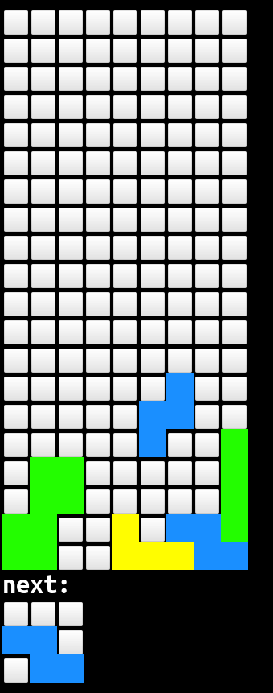
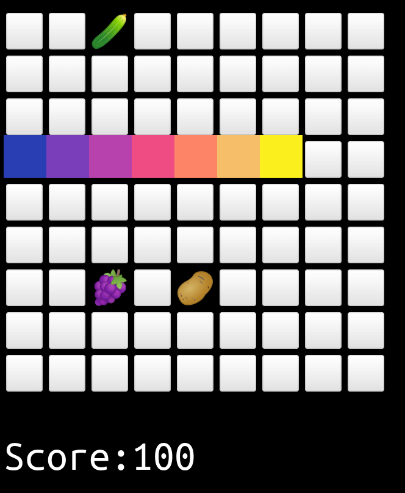

# Games

Theese are games I did code, they might or might not work on other terminals than kitty.
You can usually get the options via `--help` commandline argument

## 2048
A 2048 clone, which you play with your arrow keys.
## bao
This one is a bit tricky.
Its a clone of an african game which I'm not certain I implemented properly.
Here's [its Wikipedia page](https://en.wikipedia.org/wiki/Bao_(game)) if you're interested.
It does not have a computer opponent, yet.
## bbcpss
Unfinished, ignore me
## flap
Unfinished flappy bird clone using the kitty terminal graphics protocol.
## mathdoku
This thing spits out a html document which you can load in your browser.
its basically a clone of a sudoku clone.
## minimine
A minesweeper game which uses the mouse in the terminal.
## minesweeper
See readme in subfolder.
## mspaint
Not really a game, or is it?
You can load a bmp I think and then draw.
Saving your art is not supported yet 🤷.
## tetrinal

## texas_holdem
Unfinished, ignore me
## typical terminal snakes

This game features a snake of which you can change directions with your arrow keys.
You should eat all
