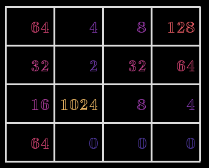
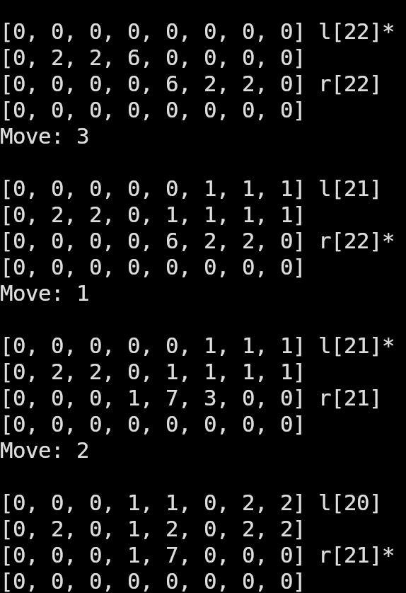
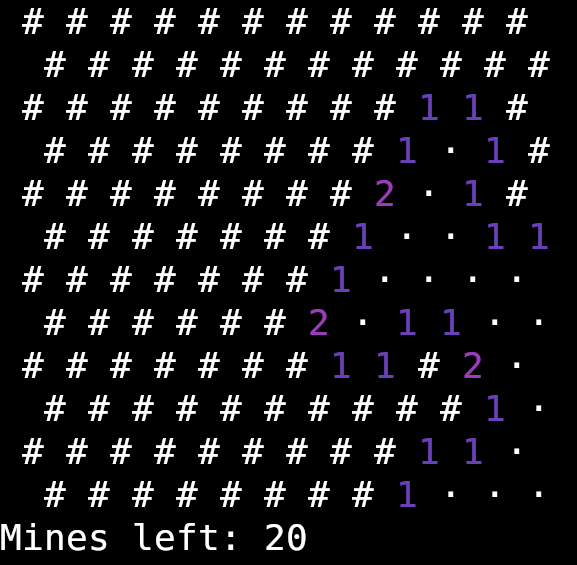
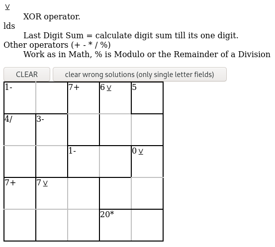
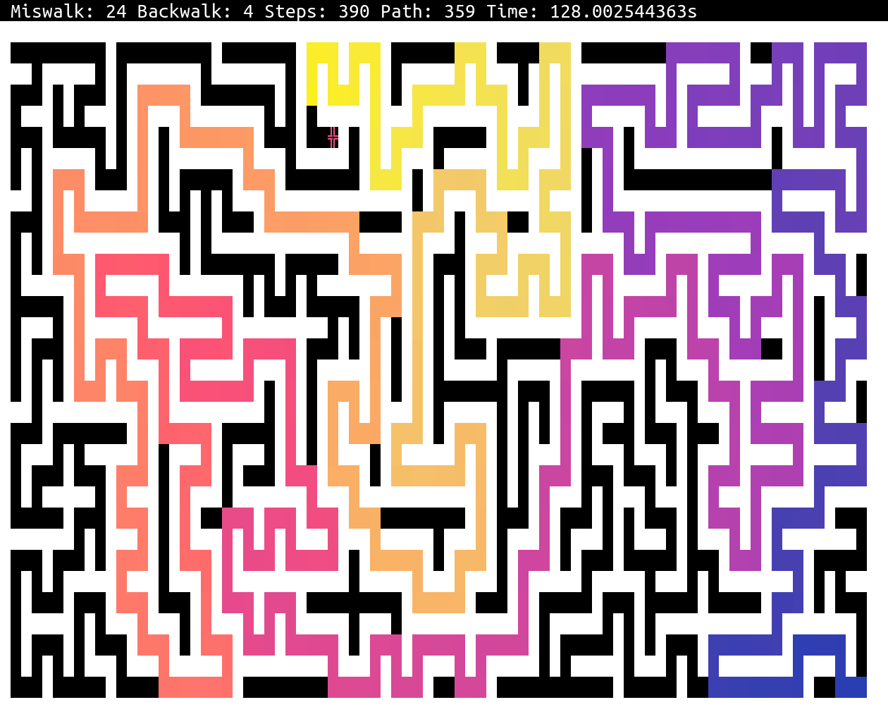
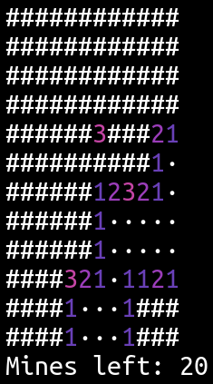
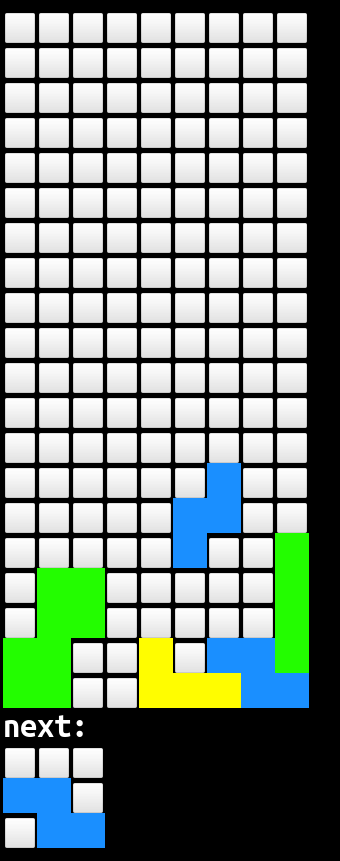
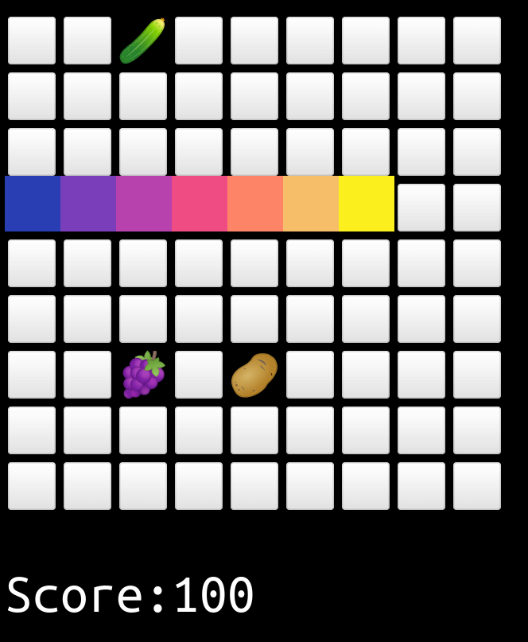

# Games

Theese are games I did code, they might or might not work on other terminals than kitty.
You can usually/sometimes get the options via `--help` commandline argument.

It might be that there are weird dependencies to `optsparser_generator` gem and in this whole ruby git repo.

## 2048

A 2048 clone, which you play with your arrow keys.

## bao

This one is a bit tricky.
Its a clone of an african game which I'm not certain I implemented properly.
Here's [its Wikipedia page](https://en.wikipedia.org/wiki/Bao_(game)) if you're interested.
It does not have a computer opponent, yet.

## bbcpss
Unfinished, ignore me

## flap
Flappy bird clone using the kitty terminal graphics protocol.
It requires some copyrighted pictures which are not mine, those are not included.

## flip
An old unfinished logic game where you flip white and black fields to turn the entire 2D plane one color.
Then you are tasked to reverse the colors to the other side.

Its usually not completeable due to creating the puzzles wrong, there is also no win condition.

## hexmine

Minesweeper in hexagonal, because hexagonal games are the best I got told.

## mathdoku

This thing spits out a html document which you can load in your browser.
its basically a clone of a sudoku clone.
It may be playable in terminals in the future.

## maze

Walk the maze using your cursor keys.
There's different difficulties: eazy, normal, har and hard.
You can also add `--death` which makes you die if you walk against walls.

Some highscores are recorded at the bottom of the code.

## minesweeper
See [readme in subfolder](minesweeper/readme.md).

## minimine

A minesweeper game which uses the mouse in the terminal.
Left click = uncover
Right click = mark as mine (which then leads to winning)

## pong
unfinished, ignore

## tetrinal

Tetris like game but no bagged random, it gets fast quick (you can optionally change this).
Also colors are random, enjoy.

## texas_holdem
Unfinished, ignore me

## typical terminal snakes

This game features a snake of which you can change directions with your arrow keys.
You should eat all vegetables and fruit. Everything else kills you.

Disable bad food with `--no-bad-food`.

Note: input is processed on a fixed schedule and will only use the last value.
