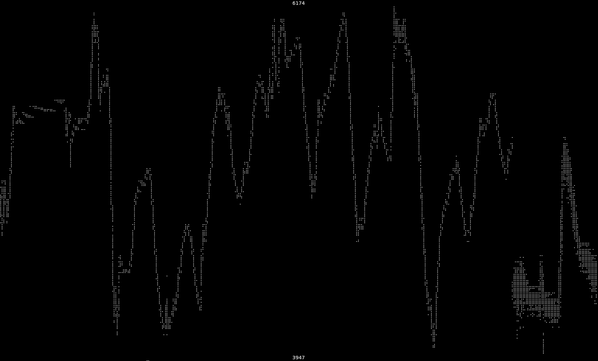
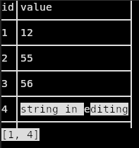

# Terminalapps

This is a collection of programs that run in the terminal:
* [games](games/readme.md)
* [malinder](malinder/readme.md)
* This folder currently mostly contains productivity tools

# Braille Plot

Unfinished renderer for data into graphs using Braille characters.

# Image Viewer

My replacement to get rid of the last XOrg programm feh on my computer, a simple image viewer.
It uses the vips library to render many many formats into your terminal (pdfs and gifs only first page/frame).

No screenshot because it mostly just shows other content.
It allows for zooming with `+` and `-` then you can use `ctrl` + cursor keys to move.

It also can load folders and multiple images given via cli. There's also `--random` to shuffle the order and `--rotate` to get a simple slideshow which can be paused using space.

# Paint

Unfinished painting software implementation.
It currently draws pure white single pixels and has no saving support.

Warning it will use `convert` from ImageMagick to convert the image, even when using its native BMP format.

# Table Editor

An unfisnished table/csv editor.
